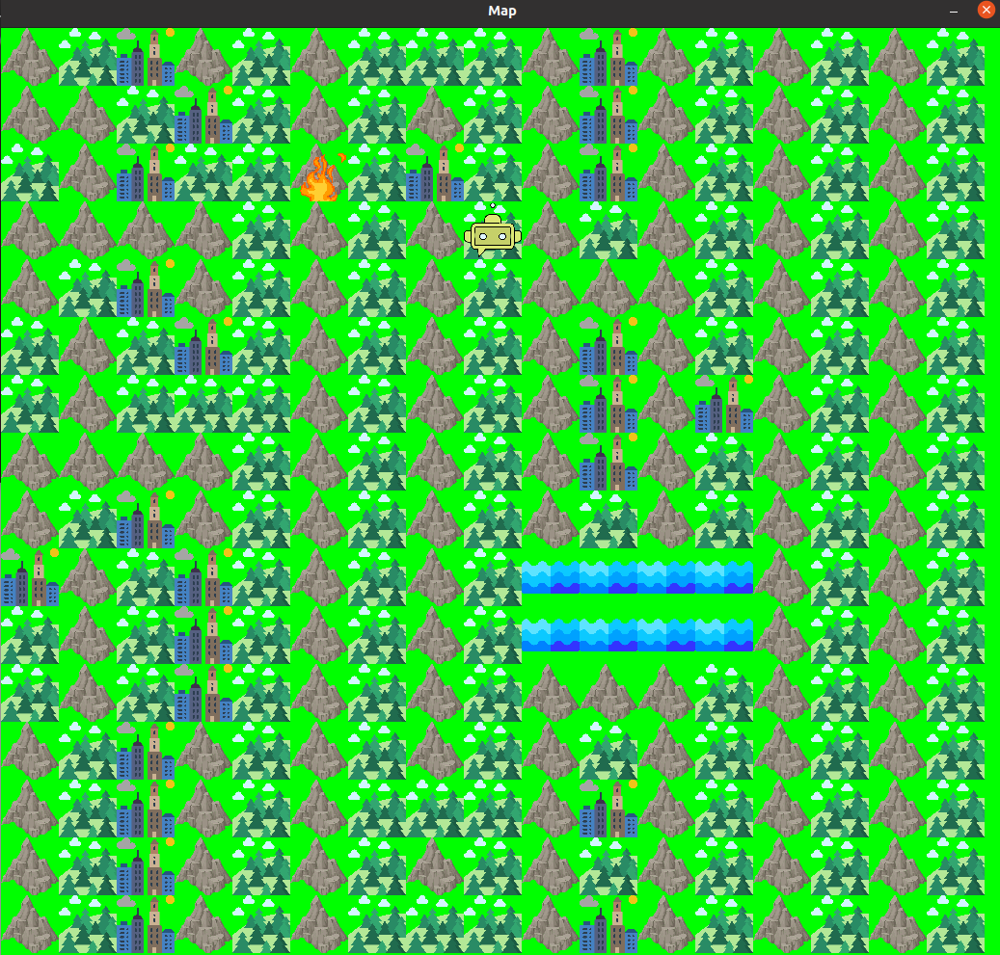

# RoboFireExtinguisher #
RoboFireExtinguisher is a project that simulates the task of a robotic fire extinguisher.

**** It is recommended to run the program on Ubuntu rather than Windows.
# Program Description #

The program is a basic simulation of a robot's task. It starts by generating a random map represented as a matrix. The fire is also randomly generated and represented by its position (x, y) and size.

The robot first checks if it has enough water to extinguish the fire. If it has enough water, it determines the shortest path to reach the fire and extinguish it. If the robot does not have enough water, it searches for the nearest water tile, moves to it, fills up with water, and then returns to extinguish the fire.  
          0 : water  
          1 : mountain  
          2 : forest  
          3 : city  

          

# Generating a Map:

To generate a map, the user has the option to create a file manually or use the "genere_carte.c" program that creates a random map. The commands to generate the map are as follows:

          gcc -o gen genere_carte.c
          ./gen "filename.txt"

 # Note: SDL Library Required

Please note that in order to run the RoboFireExtinguisher project, the SDL (Simple DirectMedia Layer) library is required. SDL is used for graphics rendering and image loading functionalities in the program. Before running the project, make sure that SDL2 and SDL2_image libraries are properly installed on your system.

To install SDL on Ubuntu, you can use the following command:

          sudo apt install libsdl2-2.0-0 libsdl2-gfx-1.0-0 libsdl2-image-2.0-0 libsdl2-mixer-2.0-0 libsdl2-net-2.0-0 libsdl2-ttf-2.0-0

For other operating systems, please refer to the official SDL documentation for installation instructions.

Once SDL is installed, you can follow the steps :

# Running the Robot Program

To execute the robot program, the user needs to enter the following command:

           gcc -o exe projet.c -lSDL2 -lSDL2_image -lm
           ./exe "map.txt"

Replace "map.txt" with the name of the text file containing the map.
# Important Considerations #

When entering the robot's position, it is essential to consider the dimensions of the map and the position of the water. If the program returns a segmentation fault error, it may be due to an incorrect robot position. In that case, it is recommended to change the robot's position.

If the program only displays the map without the moving robot, it may be due to a large number of water tiles on the map, making it difficult for the robot to find the nearest water tile.

Therefore, it is preferable to use a map with a small amount of water.
